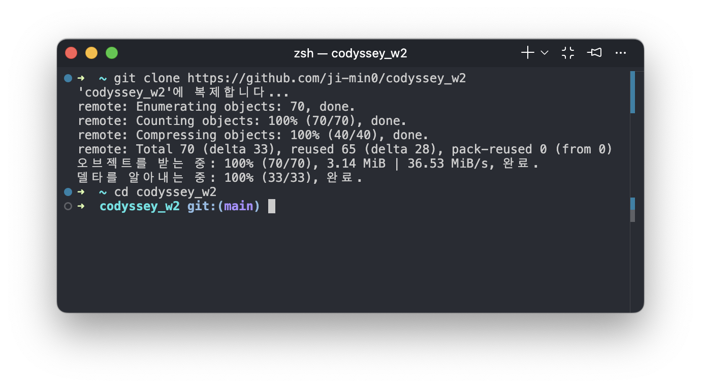
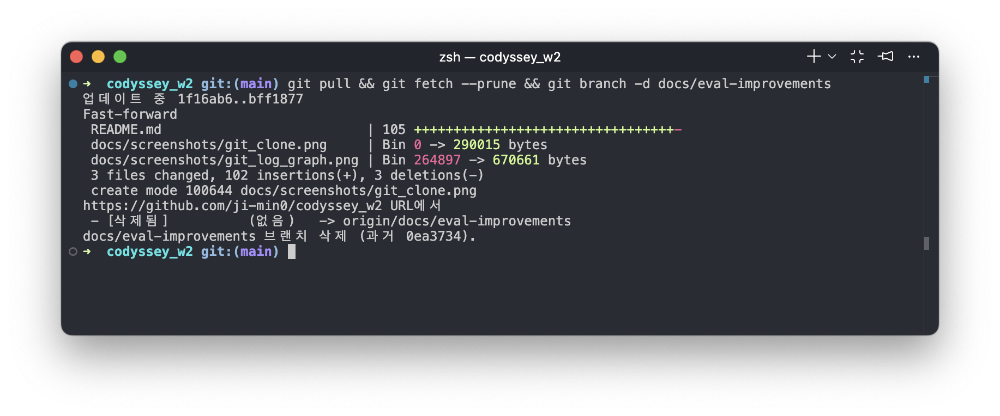
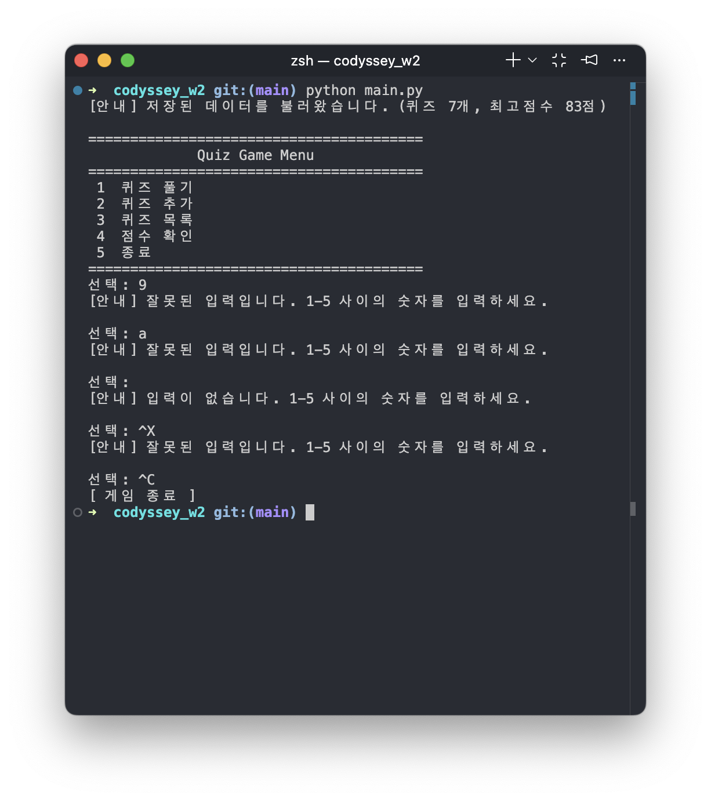

# 퀴즈 게임

터미널에서 동작하는 퀴즈 게임입니다.

## 프로젝트 개요

Python 기본 문법(입출력, 조건문, 반복문, 함수)과 클래스(객체 지향)를 이용해 터미널에서 실행되는 퀴즈 게임을 처음부터 끝까지 구현한 프로젝트입니다. 퀴즈 데이터와 최고 점수는 `state.json` 파일에 저장되어, 프로그램을 종료했다가 다시 실행해도 그대로 유지됩니다.

## 퀴즈 주제 선정 이유

주제는 영화·드라마·뮤지컬·연극을 아우르는 **대중문화 콘텐츠**로 정했습니다. 평소 즐겨 보는 콘텐츠라 문제와 오답 선택지를 만들기 수월했고, 감독/작가/배우 같은 사실 기반 정보라 정답이 명확해 객관식 문제로 만들기에도 적합했습니다.

## 실행 방법

Python 3.10 이상이 필요합니다.

```bash
python3 main.py
```

## 기능 목록

- **퀴즈 풀기**
	- 등록된 퀴즈를 순서대로 출제하고, 정답을 입력받아 정답/오답 여부와 최종 결과(점수)를 보여줍니다.
	- 최고 점수를 새로 달성하면 안내 후 저장합니다.
- **퀴즈 추가**
	- 문제, 선택지 4개, 정답 번호를 입력받아 새 퀴즈를 등록하고 즉시 `state.json`에 저장합니다.
- **퀴즈 목록**
	- 등록된 모든 퀴즈의 문제를 번호와 함께 보여줍니다.
- **점수 확인**
	- 저장된 최고 점수를 보여줍니다.
	- 아직 퀴즈를 푼 기록이 없으면 안내 메시지를 보여줍니다.
- **공통 입력 처리**
	- 숫자 입력이 필요한 모든 곳에서 공백 제거, 숫자 변환 실패, 빈 입력, 범위 밖 입력을 처리하고 재입력을 받습니다.
	- `Ctrl+C`, 입력 스트림 종료. (`EOFError`) 발생 시에도 저장 후 안전하게 종료합니다.

## 파일 구조

```
codyssey_w2/
├── main.py       # QuizGame 클래스 (메뉴, 게임 진행, 파일 저장/불러오기)
├── quiz.py       # Quiz 클래스 (개별 퀴즈 데이터 및 동작)
├── quiz_data.py  # 기본 퀴즈 데이터 (영화/드라마/뮤지컬/연극 6개)
├── state.json    # 실행 중 생성되는 저장 파일 (커밋 대상 아님)
├── .gitignore
└── README.md
```

## 데이터 파일 설명 (state.json)

- **위치**: 프로젝트 루트 (`main.py`와 같은 위치)
- **인코딩**: UTF-8
- **역할**
	- 등록된 퀴즈 목록과 최고 점수를 저장해, 프로그램을 재시작해도 데이터가 유지되도록 합니다. 
	- 사용자마다 내용이 달라지는 실행 결과물이라 저장소에는 커밋하지 않고 `.gitignore`로 제외했습니다.
- **파일이 없을 때**: `quiz_data.py`의 기본 퀴즈 6개로 시작합니다.
- **파일이 손상됐을 때**: 안내 메시지를 출력하고 기본 퀴즈 데이터로 복구합니다.

### 스키마

```json
{
    "quizzes": [
        {
            "question": "영화 '기생충'으로 아카데미 감독상을 받은 감독은?",
            "choices": ["박찬욱", "봉준호", "김기덕", "이창동"],
            "answer": 2
        }
    ],
    "best_score": 100
}
```

| 필드 | 타입 | 설명 |
|---|---|---|
| `quizzes` | list | 퀴즈 목록. 각 항목은 `question`(문제), `choices`(선택지 4개), `answer`(정답 번호 1~4) |
| `best_score` | int \| null | 지금까지 기록한 최고 점수. 아직 퀴즈를 푼 적이 없으면 `null` |

## 설계 노트

### 클래스로 구조화한 이유

퀴즈 하나(`Quiz`)와 게임 전체 흐름(`QuizGame`)은 책임이 다릅니다. 
- `Quiz`는 문제·선택지·정답이라는 데이터와 "정답인지 확인한다"는 동작을 하나로 묶어 관리하고, 
- `QuizGame`은 메뉴 진행·입력 처리·파일 저장 같은 게임 운영을 담당합니다.

함수와 전역 변수로만 작성하면 퀴즈 개수가 늘어나거나 상태(퀴즈 목록, 최고 점수)가 여러 함수에 걸쳐 공유될 때 어떤 함수가 무엇을 바꾸는지 추적하기 어려워집니다. 클래스로 나누면 각 객체가 자신의 데이터를 스스로 책임지므로(캡슐화) 기능을 추가할 때 영향 범위를 좁힐 수 있습니다.

### state.json(JSON)을 쓴 이유

퀴즈 데이터와 최고 점수는 구조가 단순(리스트 + 몇 개의 필드)해서 별도 DB 없이도 충분하고, JSON은 Python 표준 라이브러리(`json`)만으로 읽고 쓸 수 있어 외부 의존성이 없습니다. 텍스트 기반이라 파일을 직접 열어 값을 확인·수정하기도 쉽고, `dict`/`list`와 구조가 그대로 대응돼 `Quiz.to_dict()` / `Quiz.from_dict()`로 변환이 단순해집니다.

### 확장성 및 백업에 대한 고려

현재는 퀴즈를 리스트 순회(`O(n)`)로 다루기 때문에 수백~수천 개 규모까지는 문제가 없지만, 훨씬 커지면(수만 개 이상) 검색·중복 체크 비용이 늘어날 수 있습니다. 이 경우 인덱싱이 가능한 SQLite 등으로 옮기는 것을 고려할 수 있습니다. 또한 현재 `save_state()`는 기존 `state.json`을 바로 덮어쓰는 방식이라 쓰기 도중 오류가 나면 데이터가 손실될 수 있습니다. 향후 개선한다면 임시 파일에 먼저 쓰고 정상적으로 저장된 뒤 교체(atomic write)하거나, 저장 전 `state.json.bak`으로 이전 버전을 남기는 방식을 추가할 수 있습니다.

## Git 작업 방식

### 원격 저장소

- GitHub: https://github.com/ji-min0/codyssey_w2
- 기본 브랜치: `main`

### 커밋 메시지 규칙

기능 단위로 커밋하며, 접두사로 변경 종류를 구분합니다.

- `feat:` 새로운 기능 추가 (예: `feat: 퀴즈 풀기 기능 구현`)
- `fix:` 버그 수정 (예: `fix: 최고 점수 갱신 메시지 오타 수정`)
- `docs:` 문서 변경 (예: `docs: README 작성`)
- `chore:` 부수적인 설정 변경 (예: `chore: state.json을 .gitignore에 추가`)

### 브랜치 전략

기능마다 `main`에서 `feature/기능이름` 브랜치를 새로 만들어 작업 -> `git merge --no-ff`로 `main`에 병합

-  `--no-ff`를 쓴 이유: 기능별 작업 단위가 커밋 그래프에 병합 지점(`Merge branch '...'`)으로 남아, 히스토리만 보고도 "이 기능이 어느 브랜치에서 작업됐는지"를 알 수 있게 하기 위해서입니다.

### 여러 환경에서의 작업 (clone)

코디세이 캐빈에서 작업을 진행했기 때문에, 해당 과제를 여러 대의 컴퓨터를 오가며 진행하였습니다. 따라서 새로운 환경에서 작업을 시작할 때마다 `git clone https://github.com/ji-min0/codyssey_w2.git`으로 저장소를 새로 받아온 뒤 이어서 작업했습니다.



### GitHub에서 병합 후 로컬 동기화 (pull)

지금까지는 로컬에서 브랜치를 만들고 바로 `merge`해왔기 때문에 `pull`을 쓸 일이 없었습니다. 하지만 pull을 한 번 이상 사용해야 한다는 제약사항을 위해 이 커밋(`docs/eval-improvements`)은 일부러 GitHub 웹에서 PR을 만들어 merge한 뒤, 로컬 `main`에서 그 결과를 받아오는 방식으로 진행해 `pull`을 실습했습니다.

- `git pull`: 원격(`origin/main`)에 GitHub에서 병합한 커밋을 로컬 `main`으로 받아옵니다.
- `git fetch --prune`: PR을 merge하면서 GitHub에서 `docs/eval-improvements` 브랜치를 삭제했는데, 로컬에는 그 브랜치를 가리키는 원격 추적 참조(`origin/docs/eval-improvements`)가 그대로 남아있습니다. `--prune` 옵션으로 원격에 더 이상 없는 이 참조를 정리했습니다.
- `git branch -d docs/eval-improvements`: 이제 필요 없어진 로컬 브랜치를 삭제합니다. `-d`는 해당 브랜치가 `main`에 이미 병합된 경우에만 삭제를 허용하는 안전한 옵션이라, 병합 안 된 작업이 실수로 삭제될 위험이 없습니다.



### 커밋 로그 (`git log --oneline --graph`) 

리드미 작성 기준 총 26개 커밋(병합 커밋 포함, `git log --oneline | wc -l` 기준)이 쌓여 있으며, 기능마다 브랜치 생성 후 병합한 기록을 위 로그에서 확인할 수 있습니다. 이후 커밋 혹은 머지 기록이 추가될 수 있으나, 최신화 반영은 하지 않을 것입니다.


하단의 텍스트 박스는 네이토 평가를 위한 것입니다.

```
* 1f16ab6 (HEAD -> docs/eval-improvements, origin/main, origin/HEAD, main) docs: 잘못된 입력 처리 스크린샷 추가
* 3d9b437 docs: 실행 화면 및 개발 환경 스크린샷 추가
*   54bd5c7 Merge branch 'docs/readme'
|\
| * a3b64cb docs: README 작성
|/
*   af2862f Merge branch 'feature/score'
|\
| * 4c50283 feat: 점수 확인 기능 구현
|/
*   c5482e7 Merge branch 'feature/quiz-list'
|\
| * 148bb7e feat: 퀴즈 목록 기능 구현
|/
*   727c6ee Merge branch 'feature/quiz-add'
|\
| * f60de83 feat: 퀴즈 추가 기능 구현
| * b4625d1 fix: 최고 점수 갱신 메시지 오타 수정
|/
*   cf619d6 Merge branch 'feature/quiz-play'
|\
| * 92790f5 feat: 퀴즈 풀기 기능 구현
|/
*   6c77bc2 Merge branch 'feature/state-io'
|\
| * a95cf3c chore: state.json을 .gitignore에 추가
| * e85e159 feat: state.json 저장/불러오기 기능 구현
| * ae676e4 feat: Quiz 클래스에 JSON 변환 메서드 추가
|/
*   57bb447 Merge branch 'feature/quiz-data'
|\
| * bbf5e2c feat: 기본 퀴즈 데이터 작성
|/
*   c713ddb Merge branch 'feature/quiz-class'
|\
| * 0afde30 feat: Quiz 클래스 작성
|/
*   3ee2b2c Merge branch 'feature/menu'
|\
| * a66860c feat: 메뉴 출력 및 선택 루프 구현
|/
* 1d4e266 init: 프로젝트 초기 설정
```


## 실행 화면

| 메뉴 | 퀴즈 풀기 |
|---|---|
|  |  |

| 퀴즈 추가 | 퀴즈 목록 |
|---|---|
|  |  |

| 점수 확인 | 재실행 후 데이터 유지 |
|---|---|
|  |  |

프로그램을 종료했다가 다시 실행하면, 저장된 퀴즈 개수와 최고 점수를 불러와 메뉴 상단에 안내합니다. (`menu_after_play.png`)

### 잘못된 입력 처리



범위 밖 숫자(`9`), 숫자 변환 실패(`a`), 빈 입력, `Ctrl+C` 순으로 안내 메시지 출력 후 재입력 또는 안전 종료되는 것을 확인할 수 있습니다.


## 개발 환경

| Python / Git 버전 | Git 설정 (`git config --list`) |
|---|---|
|  |  |
