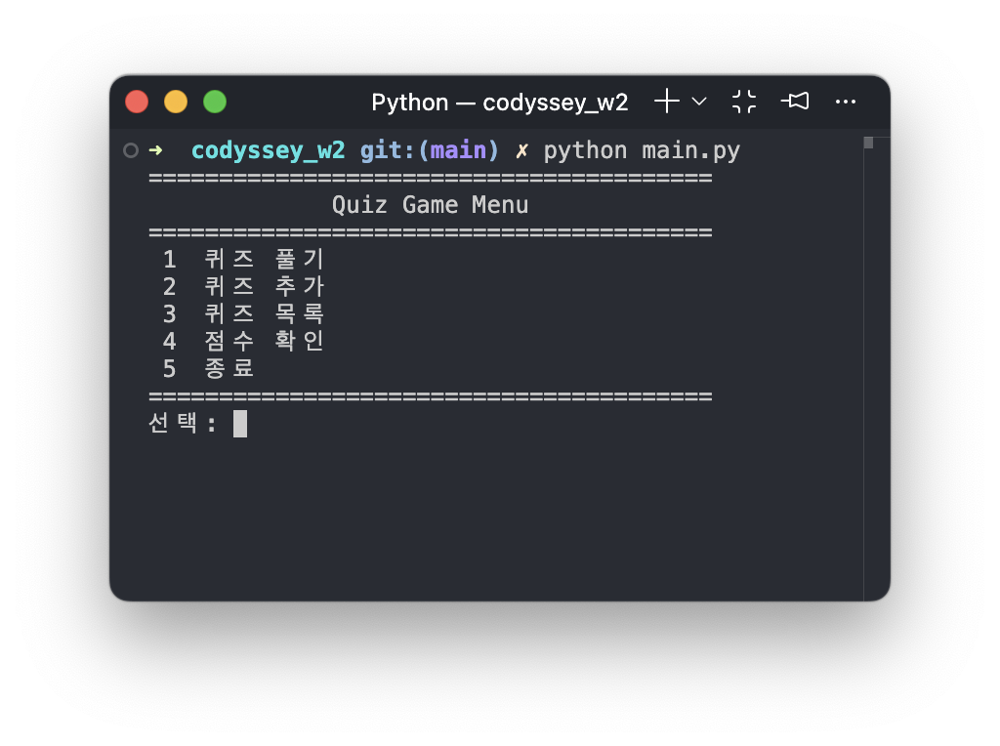
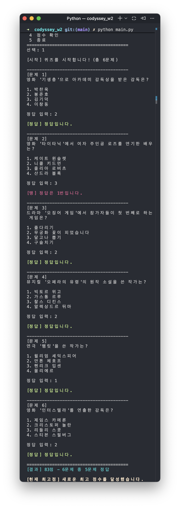
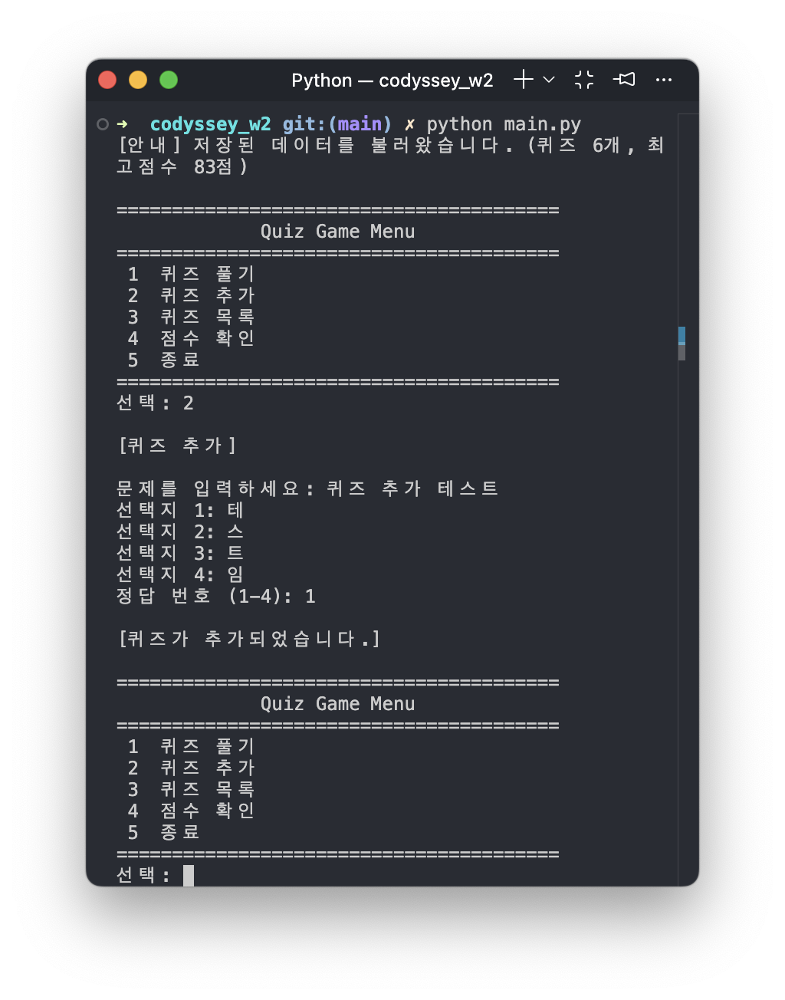
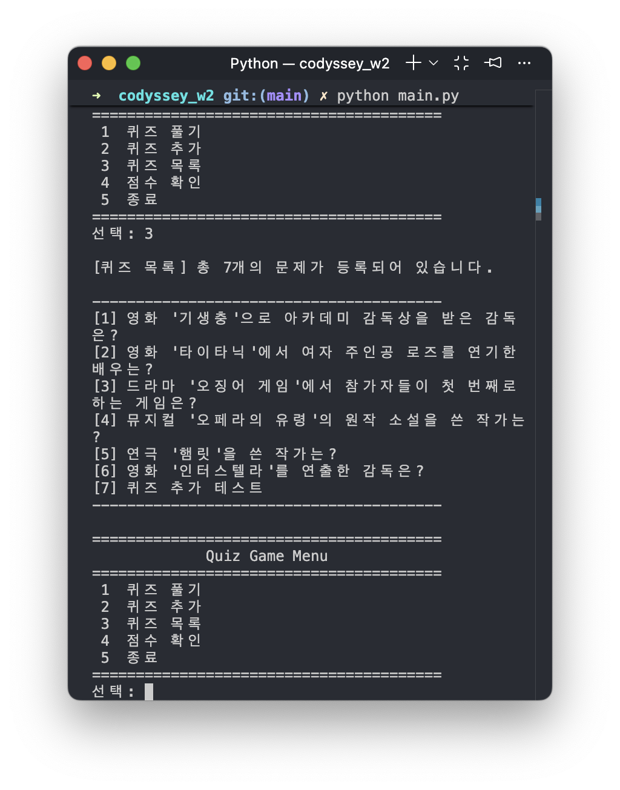
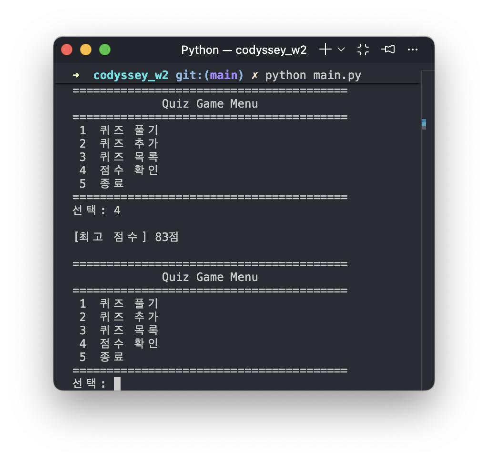
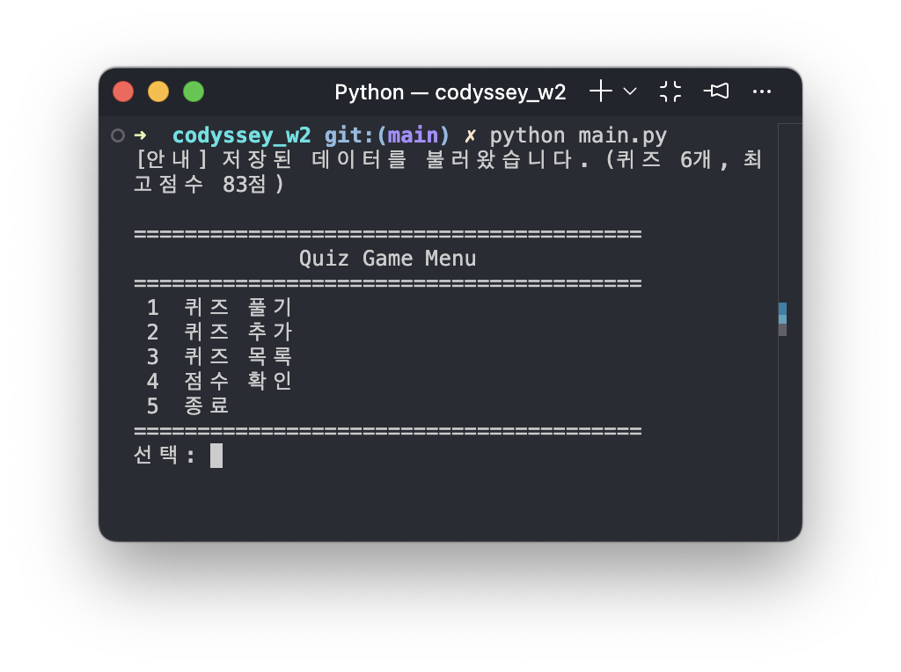
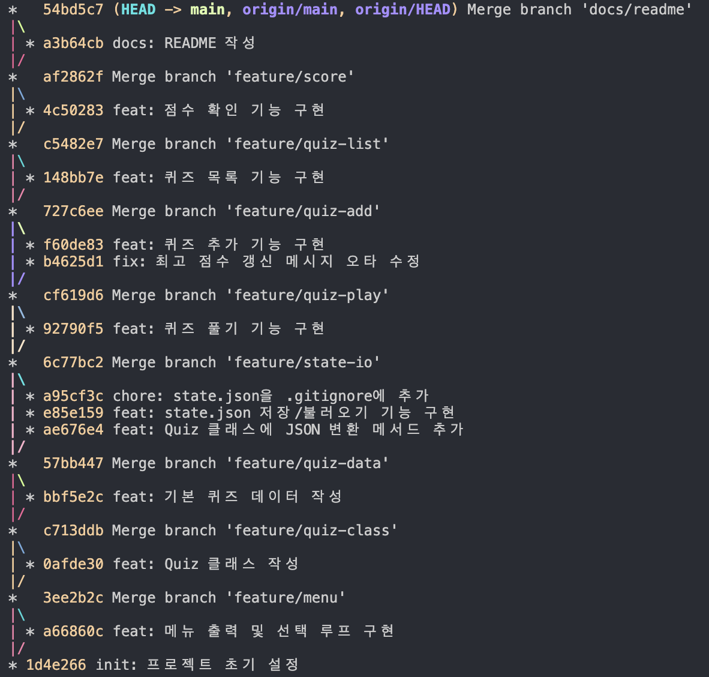
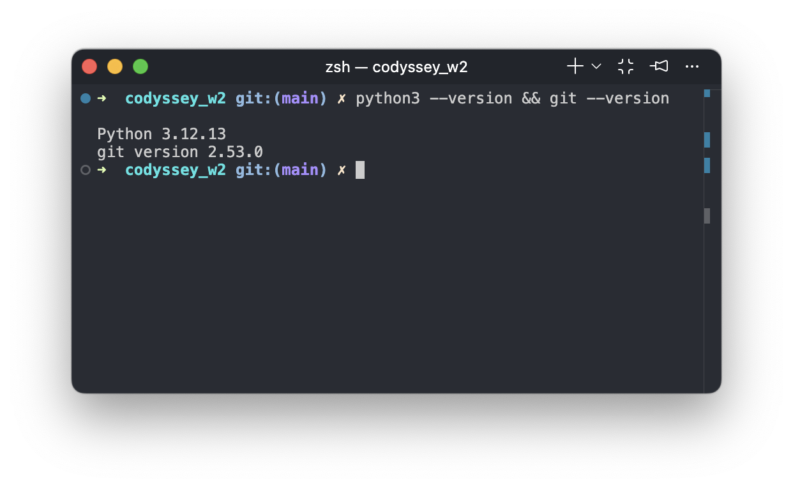
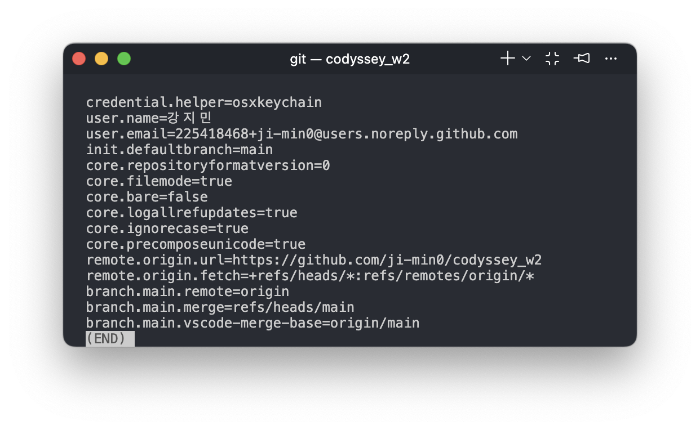

# 퀴즈 게임

터미널에서 동작하는 퀴즈 게임입니다.

## 프로젝트 개요

Python 기본 문법(입출력, 조건문, 반복문, 함수)과 클래스(객체 지향)를 이용해 터미널에서 실행되는 퀴즈 게임을 처음부터 끝까지 구현한 프로젝트입니다. 퀴즈 데이터와 최고 점수는 `state.json` 파일에 저장되어, 프로그램을 종료했다가 다시 실행해도 그대로 유지됩니다.

## 퀴즈 주제 선정 이유

주제는 영화·드라마·뮤지컬·연극을 아우르는 **대중문화 콘텐츠**로 정했습니다. 평소 즐겨 보는 콘텐츠라 문제와 오답 선택지를 만들기 수월했고, 감독/작가/배우 같은 사실 기반 정보라 정답이 명확해 객관식 문제로 만들기에도 적합했습니다.

## 실행 방법

Python 3.10 이상이 필요합니다.

```bash
python3 main.py
```

## 기능 목록

- **퀴즈 풀기**
	- 등록된 퀴즈를 순서대로 출제하고, 정답을 입력받아 정답/오답 여부와 최종 결과(점수)를 보여줍니다.
	- 최고 점수를 새로 달성하면 안내 후 저장합니다.
- **퀴즈 추가**
	- 문제, 선택지 4개, 정답 번호를 입력받아 새 퀴즈를 등록하고 즉시 `state.json`에 저장합니다.
- **퀴즈 목록**
	- 등록된 모든 퀴즈의 문제를 번호와 함께 보여줍니다.
- **점수 확인**
	- 저장된 최고 점수를 보여줍니다.
	- 아직 퀴즈를 푼 기록이 없으면 안내 메시지를 보여줍니다.
- **공통 입력 처리**
	- 숫자 입력이 필요한 모든 곳에서 공백 제거, 숫자 변환 실패, 빈 입력, 범위 밖 입력을 처리하고 재입력을 받습니다.
	- `Ctrl+C`, 입력 스트림 종료. (`EOFError`) 발생 시에도 저장 후 안전하게 종료합니다.

## 파일 구조

```
codyssey_w2/
├── main.py       # QuizGame 클래스 (메뉴, 게임 진행, 파일 저장/불러오기)
├── quiz.py       # Quiz 클래스 (개별 퀴즈 데이터 및 동작)
├── quiz_data.py  # 기본 퀴즈 데이터 (영화/드라마/뮤지컬/연극 6개)
├── state.json    # 실행 중 생성되는 저장 파일 (커밋 대상 아님)
├── .gitignore
└── README.md
```

## 데이터 파일 설명 (state.json)

- **위치**: 프로젝트 루트 (`main.py`와 같은 위치)
- **인코딩**: UTF-8
- **역할**
	- 등록된 퀴즈 목록과 최고 점수를 저장해, 프로그램을 재시작해도 데이터가 유지되도록 합니다. 
	- 사용자마다 내용이 달라지는 실행 결과물이라 저장소에는 커밋하지 않고 `.gitignore`로 제외했습니다.
- **파일이 없을 때**: `quiz_data.py`의 기본 퀴즈 6개로 시작합니다.
- **파일이 손상됐을 때**: 안내 메시지를 출력하고 기본 퀴즈 데이터로 복구합니다.

### 스키마

```json
{
    "quizzes": [
        {
            "question": "영화 '기생충'으로 아카데미 감독상을 받은 감독은?",
            "choices": ["박찬욱", "봉준호", "김기덕", "이창동"],
            "answer": 2
        }
    ],
    "best_score": 100
}
```

| 필드 | 타입 | 설명 |
|---|---|---|
| `quizzes` | list | 퀴즈 목록. 각 항목은 `question`(문제), `choices`(선택지 4개), `answer`(정답 번호 1~4) |
| `best_score` | int \| null | 지금까지 기록한 최고 점수. 아직 퀴즈를 푼 적이 없으면 `null` |

## 실행 화면

| 메뉴 | 퀴즈 풀기 |
|---|---|
|  |  |

| 퀴즈 추가 | 퀴즈 목록 |
|---|---|
|  |  |

| 점수 확인 | 재실행 후 데이터 유지 |
|---|---|
|  |  |

프로그램을 종료했다가 다시 실행하면, 저장된 퀴즈 개수와 최고 점수를 불러와 메뉴 상단에 안내합니다. (`menu_after_play.png`)

### Git 커밋 히스토리



## 개발 환경

| Python / Git 버전 | Git 설정 (`git config --list`) |
|---|---|
|  |  |
